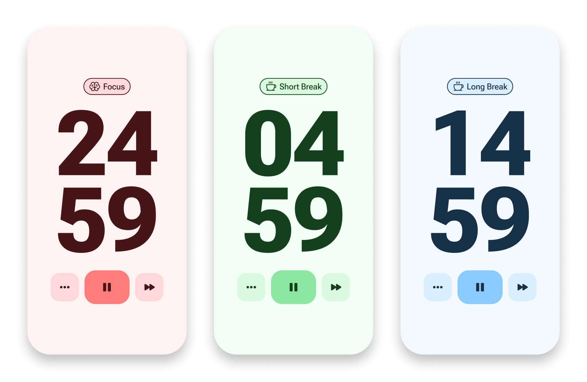

<div id="top"></div>

<!-- PROJECT LOGO -->
<br />
<div align="center">
  <a href="https://alexandrlo.github.io/pomo/">
    
  </a>

<h3 align="center">Pomo</h3>

  <p align="center">
    An online Pomodoro Timer to boost your productivity
    <br />
    <br />
    <a href="https://alexandrlo.github.io/pomo/">View App</a>
    ·
    <a href="https://www.figma.com/community/file/1112830528857083939">Figma File</a>
    ·
    <a href="https://github.com/AlexandrLo/pomo/issues">Report Bug</a>
    ·
    <a href="https://github.com/AlexandrLo/pomo/issues">Request Feature</a>   
    <br />
    <br />
    <a href="https://github.com/AlexandrLo/pomo/actions/workflows/deploy.yml">
      
    </a>
    <a href="https://github.com/AlexandrLo/pomo/actions/workflows/pages/pages-build-deployment">
      
    </a>
  </p>
</div>

<!-- TABLE OF CONTENTS -->
<details>
  <summary>Table of Contents</summary>
  <ol>
    <li>
      <a href="#about-the-project">About The Project</a>
      <ul>
        <li><a href="#built-with">Built With</a></li>
      </ul>
    </li>
    <li><a href="#contributing">Contributing</a></li>
    <li>
      <a href="#development-environment">Development Environment</a>
      <ul>
        <li><a href="#prerequisites">Prerequisites</a></li>
        <li><a href="#installation">Installation</a></li>
      </ul>
    </li>
    <li><a href="#license">License</a></li>
  </ol>
</details>

<!-- ABOUT THE PROJECT -->

## About The Project

<div align="center">
  <a href="https://alexandrlo.github.io/pomo/">
    
  </a>
</div>

Pomo is a customizable pomodoro timer that works on desktop & mobile browser. The aim of this app is to help you focus on any task you are working on, such as study, writing, or coding. This app is inspired by [Pomodoro Technique](https://en.wikipedia.org/wiki/Pomodoro_Technique) which is a time management method developed by Francesco Cirillo.

<p align="right">(<a href="#top">back to top</a>)</p>

### Built With

- [React](https://reactjs.org/)
- [Redux](https://redux.js.org/)
- [Chakra UI](https://chakra-ui.com/)
- [Webpack](https://webpack.js.org/)

<p align="right">(<a href="#top">back to top</a>)</p>

<!-- CONTRIBUTING -->

## Contributing

Contributions are what make the open source community such an amazing place to learn, inspire, and create. Any contributions you make are **greatly appreciated**.

If you have a suggestion that would make this better, please fork the repo and create a pull request. You can also simply open an issue with the tag "enhancement".
Don't forget to give the project a star! Thanks again!

1. Fork the Project
2. Create your Feature Branch (`git checkout -b feature/AmazingFeature`)
3. Commit your Changes (`git commit -m 'Add some AmazingFeature'`)
4. Push to the Branch (`git push origin feature/AmazingFeature`)
5. Open a Pull Request

<p align="right">(<a href="#top">back to top</a>)</p>

<!-- DEVELOPMENT ENVIRONMENT -->

## Development Environment

To contribute to a project you have to setup a development environment. Here you will find steps on how to do that.

### Prerequisites

- npm

### Installation

1. Clone the repo

   ```sh
   git clone https://github.com/AlexandrLo/pomo.git
   ```

2. Install NPM packages

   ```sh
   npm install
   ```

3. To start development server

   ```sh
   npm start
   ```

   Development server located at `localhost:8000`

<p align="right">(<a href="#top">back to top</a>)</p>

<!-- LICENSE -->

## License

Distributed under the MIT License. See `LICENSE` for more information.

<p align="right">(<a href="#top">back to top</a>)</p>
